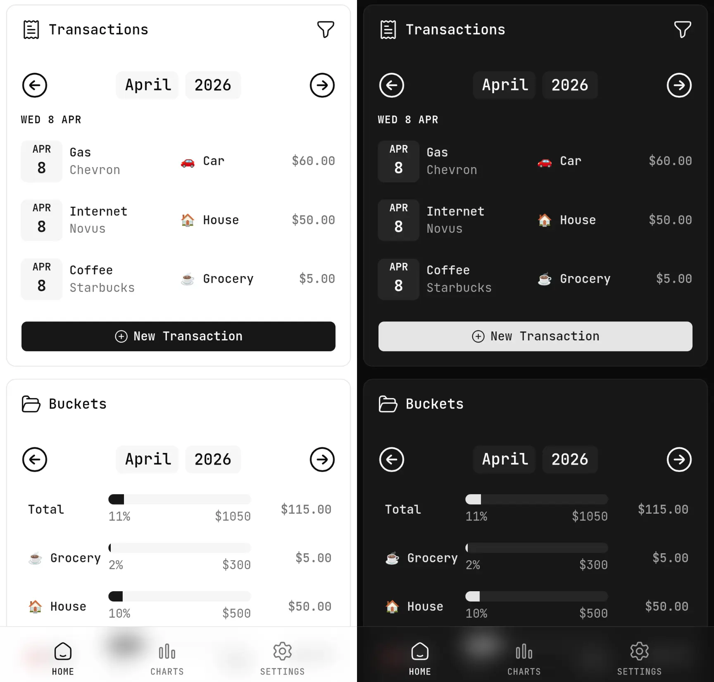
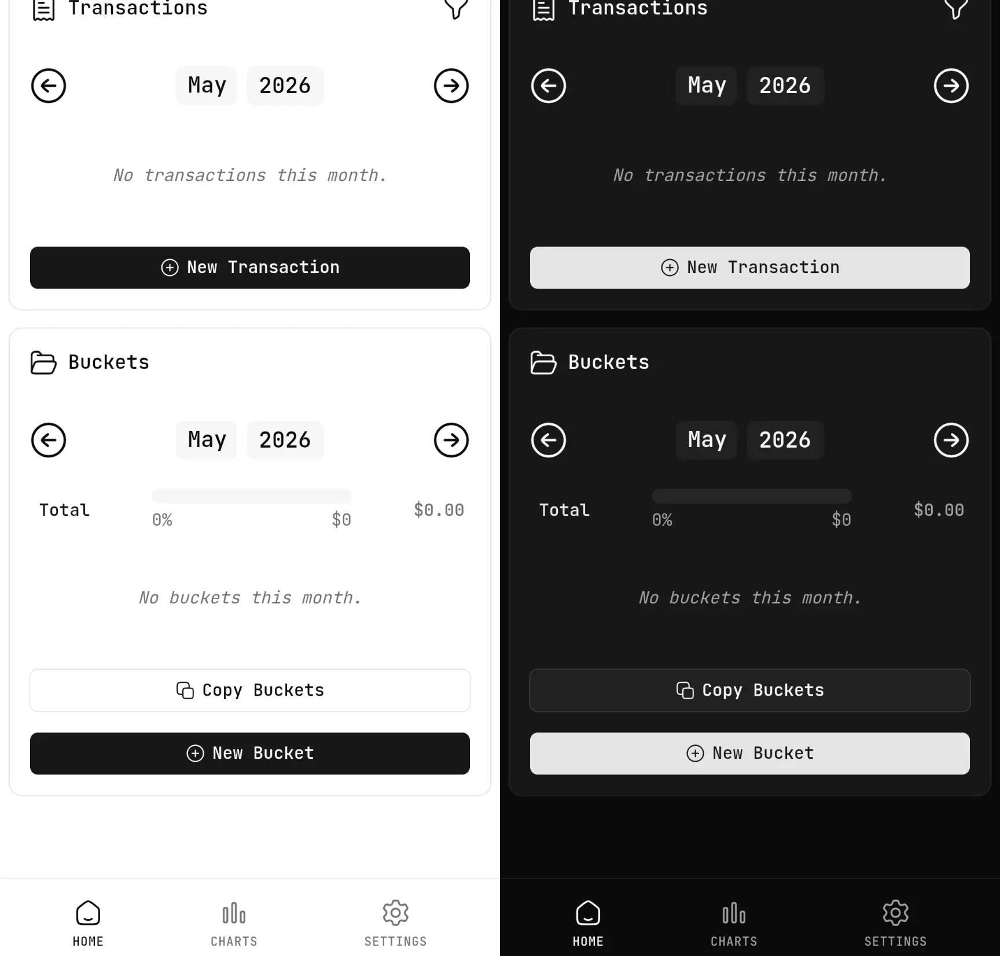
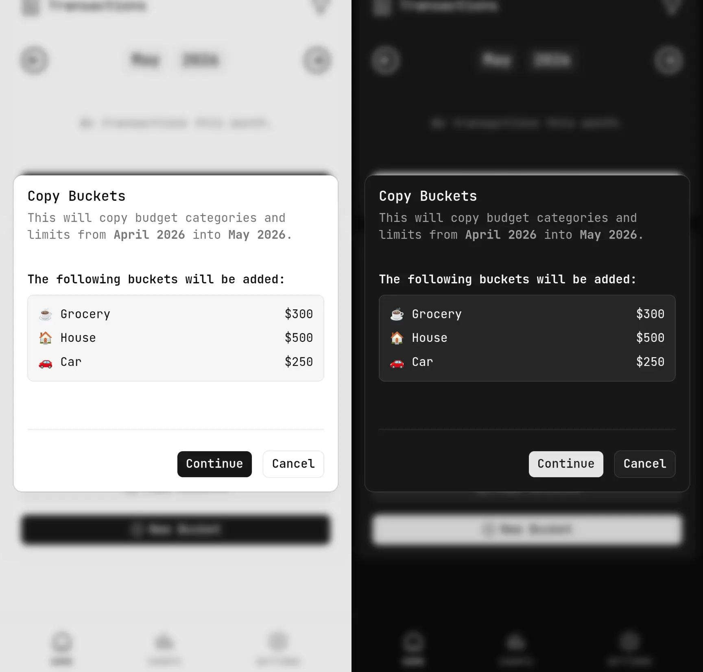
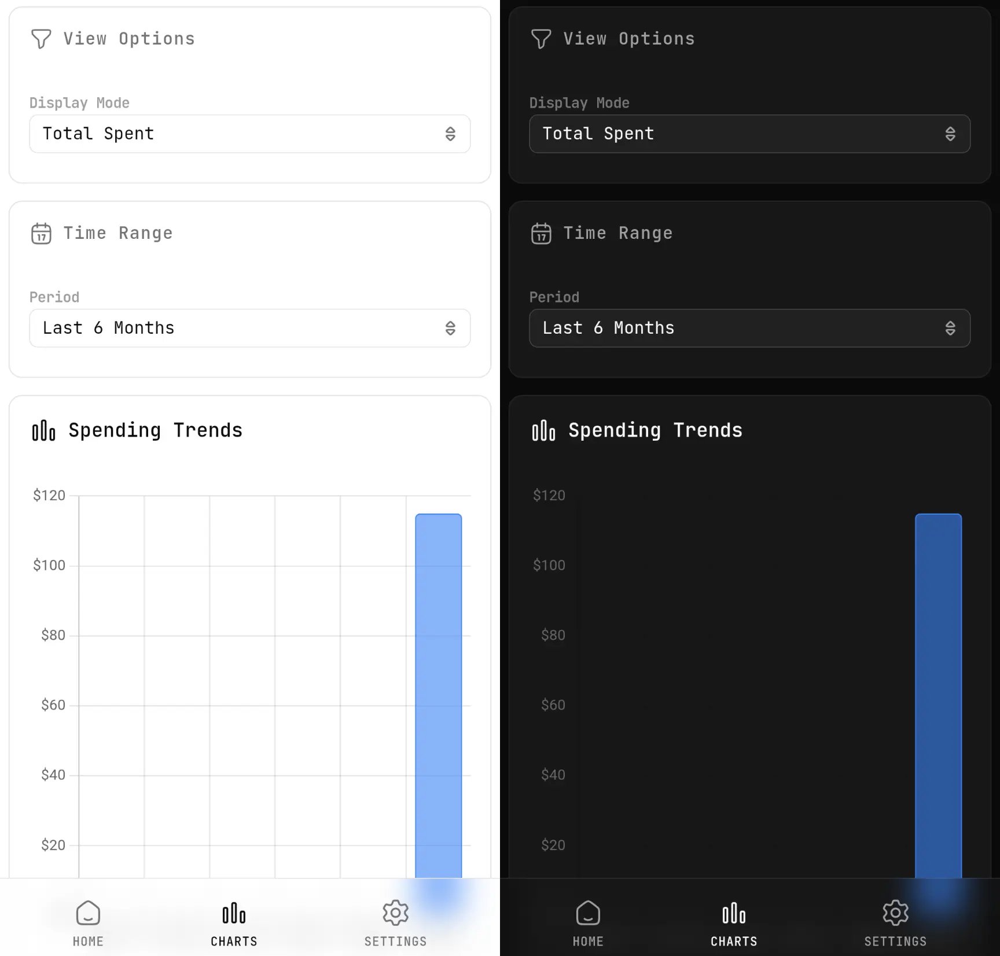
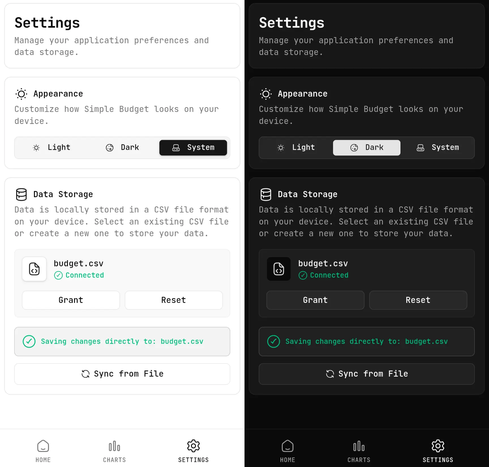

## Overview

This is a simple budget web application for my personal use and for others to use as well. It simply helps to keep track of expenses in different budget categories.

Check it out here: [https://simple-budget.singhramanpreet.com](https://simple-budget.singhramanpreet.com)

This is fully static and local only web application built with [Tanstack Router](https://tanstack.com/router/latest) framework.

## Features
- Add transactions with name, amount, and notes into a category.
- Easy copy mode for old transactions.
- Create budget categories with monthly limits.
- Easy copy previous month categories into current month.
- View total expenses and remaining budget for each category.
- Responsive design for mobile and desktop use.
- Data persistence in the `.csv` file provided by the user.
- Charts to visualize spending.
- Light, dark and system theme support.

## Tech Stack
- [Bun](https://bun.sh/) + [Tanstack Router](https://tanstack.com/router/latest)
- TypeScript
- [Tailwind CSS](https://tailwindcss.com/) + [shadcn/ui](https://ui.shadcn.com/)
- [File System API](https://developer.mozilla.org/en-US/docs/Web/API/File_System_API), browser comptability check [here](https://developer.chrome.com/docs/capabilities/web-apis/file-system-access)
- [IndexedDB](https://developer.mozilla.org/en-US/docs/Web/API/IndexedDB_API)

## Source Code
The source code for this project is available on GitHub: [https://github.com/singh-ramanpreet/simple-budget](https://github.com/singh-ramanpreet/simple-budget)

## Screenshots

