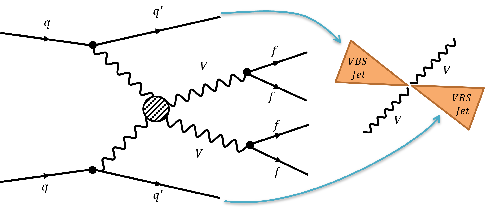
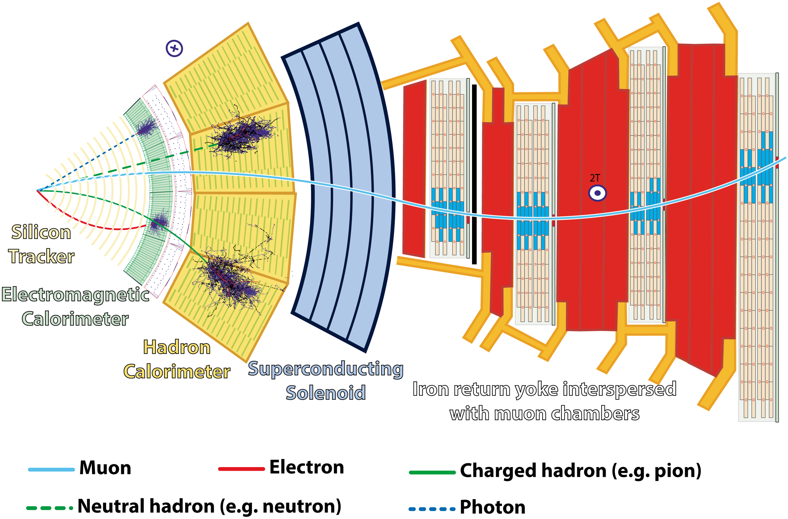



This was my primary Ph.D. research project to search for vector boson scattering, a rare elementary physics process. I studied the semileptonic ZV channel with data collected by the [CMS](https://cms.cern/) detector at [CERN](https://home.cern/).

## Introduction

Vector boson scattering is a rare process that is crucial for understanding the electroweak symmetry breaking mechanism. The process is characterized by the production of two vector bosons and two forward jets. The study of this process is essential for understanding the properties of the Higgs boson and the electroweak sector of the Standard Model.

### How is it produced?

[Large Hadron Collider (LHC)](https://home.cern/science/accelerators/large-hadron-collider) at [CERN](https://home.cern/) is used to collide protons at high energies. These collisions produce a wide range of particles, including vector bosons; the W and Z bosons. In the vector boson scattering process, two vector bosons are produced in association with two quarks which subsequently hadronize into jets. These jets are usually referred to as forward jets due to their high rapidity.

### What is seen by the detector?

Since we cannot directly observe the vector bosons, we look at final stable particles produced in their decay. In the semileptonic ZV channel, one of the vector bosons decays into a pair of charged leptons (electrons or muons), while the other decays into quarks that hadronize into jets.

The [CMS](https://cms.cern/) detector is a multipurpose particle detector that is designed to study a wide range of physics processes. It consists of several subdetectors, each designed to measure different properties of particles produced in high-energy collisions.

## Analysis

Given the rarity of the process and amount of data processing required, the analysis was a complex and challenging task. The analysis required a sophisticated data selection strategy to isolate the signal from the background.

99.998% of the events produced in the LHC are thrown away as they are not of interest. The remaining events are processed and stored for further various analyses. Even with this stringent selection, the rate of data stored is enormous (about 1 GB/s).

### Data, Real and Simulated

To understand the signal and background processes, we used both real data (usually referred to as data) and simulated data (usually referred to as Monte Carlo (MC) simulation). The simulated data is generated using theoretical models and is used to estimate the expected background and signal rates.

The data used in the analysis were collected by the CMS detector during the 2016-2018 run of the LHC at a center-of-mass energy of \\(13\space \text{TeV}\\). The data sample corresponded to an integrated luminosity of \\(137 \space \text{fb}^{-1}\\). The dataset size is in the order of petabytes and about billions of events/rows.

### Data Analysis Pipeline

I developed a data analysis pipeline using `C++` and `Python` for the event processing and `bash` scripts for parallel processing on the computing cluster. The pipeline included various steps such as data cleaning, machine learning model training, and signal extraction.

#### Data Cleaning

The data cleaning step involved removing events with no signature of our analysis topology. Like events with at least two leptons (from Z boson decay) and one/two jets (from V boson decay) and two forward jets. This step was crucial to reduce the data size and improve the throughput of the analysis.

#### Machine Learning Model Training

I developed machine learning model, boosted decision trees (BDTs) to optimize the selection of signal events. I used [TMVA](https://root.cern/) package to train the models. These models were trained using simulated data and were optimized to maximize the signal significance.

Machine learning models were better than traditional cut-based methods as they could learn the complex relationships between the input variables and the signal. About 15% improvement in signal significance was observed with the machine learning models compared to the cut-based methods.

## Results

Given the rarity of the process, the analysis did not observe a significant excess of events over the expected background. Hopefully, with more data from Run 3 of the LHC, we will be able to observe this rare process and study its properties in more detail.

I may not be part of the analysis anymore, but I am proud of the work I did and the skills I developed during this project. The project taught me a lot about particle physics, data analysis, and software development. I am grateful for the opportunity to work on such an exciting and challenging project.
